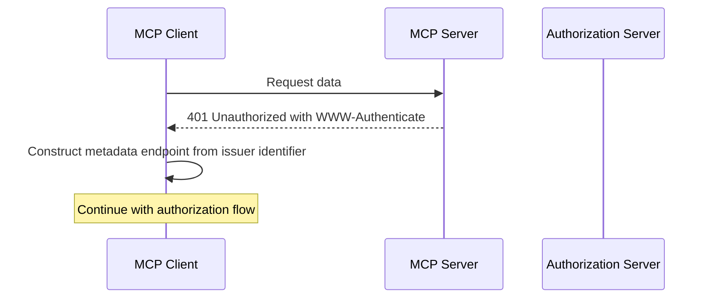
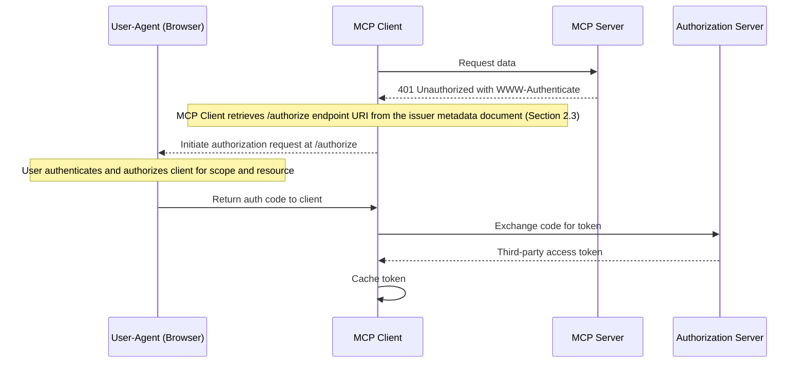
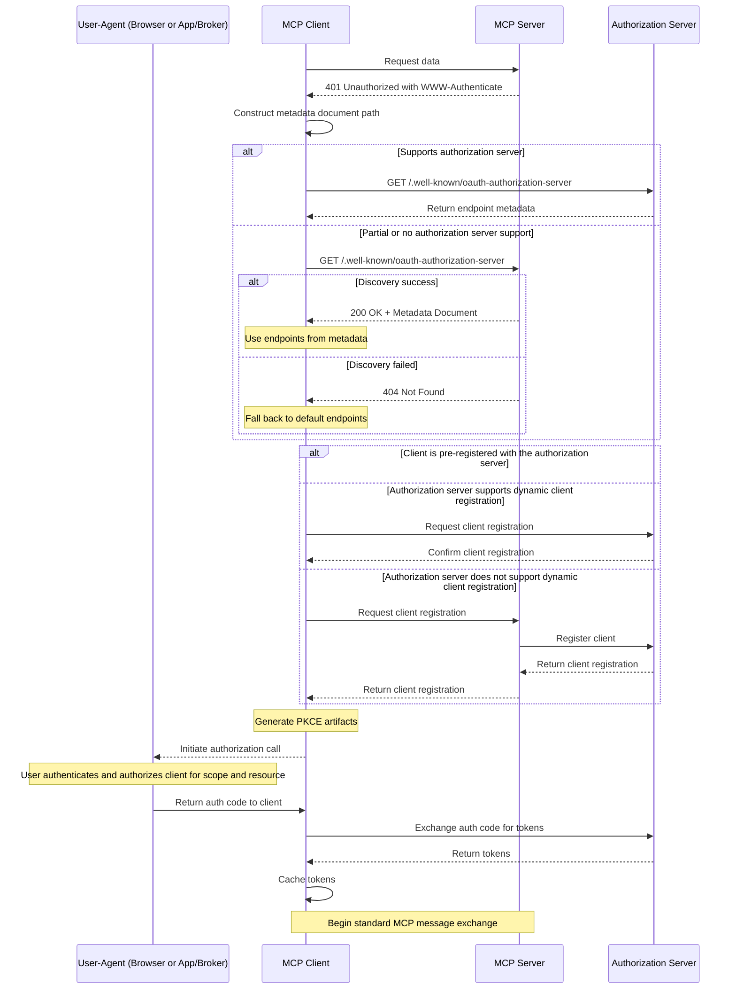
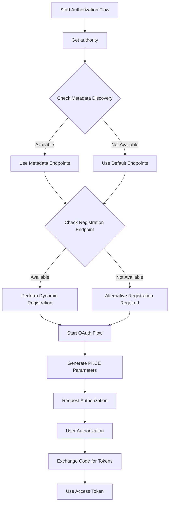

<Info>**Protocol Revision**: 2025-03-26</Info>

## 1. Introduction

### 1.1 Purpose and Scope

The Model Context Protocol provides authorization capabilities at the transport level, enabling MCP
clients to make requests to restricted MCP servers on behalf of resource owners. This specification
defines the authorization flow for HTTP-based transports.

The scope of this document is **user authorization** - how a client can authenticate a user to access a
server and the server determine whether to authorize the user to access its tools, resources, or any
other capabilities.

This document **does not discuss server-to-server authorization patterns**.

### 1.2 Baseline tenets

1. **MCP server developers are not security experts**. Developers should not be building their own
   authorization servers unless absolutely necessary. This also introduces room for serious mistakes
   that can lead to compromise.
1. **MCP clients are Authorization Server (AS)-agnostic**. We do not and will not expect clients to be
   "enlightened" in any capacity to support a protected MCP server. This will fragment the ecosystem.
   The specification explicitly assumes that clients are not enabled in any unique way to support
   specific Authorization Servers.
    - **Note:** It is acceptable for clients to be enhanced for specific Authorization Servers,
      primarily through pre-registration.
1. **User Authentication is not a MCP Server concern.** The MCP server can guide the client
   to the AS but the MCP Server will not be responsible for authenticating the user and obtaining credential
   artifacts for the user. The MCP server might transform incoming credential artifacts, like tokens, but
   it does not do any kind of exchange for the user in the client, nor does the MCP server have access
   to any user authentication credentials or protocols.
1. **We focus on OAuth 2.1, with room for extensibility for other providers/specifications.** Our
   running assumption is that most developers will want to use OAuth 2.1, however in the long-run
   unusual cases for authentication and authorization may emerge (e.g., mTLS, Kerberos), which will
   need clients to be extensible.

### 1.3 Protocol Requirements

Authorization is **OPTIONAL** for MCP implementations. When supported:

- Streamable HTTP or SSE transports **SHOULD** conform to this specification.
- Implementations using an STDIO transport **SHOULD NOT** follow this specification and instead
  retrieve credentials from the environment.
- Implementations using alternative transports **MUST** follow established security best practices for
  their protocol.

### 1.4 Standards Compliance

This authorization mechanism is based on established specifications listed below, but implements a
selected subset of their features to ensure security and interoperability while maintaining simplicity:

- [OAuth 2.1 IETF DRAFT](https://datatracker.ietf.org/doc/html/draft-ietf-oauth-v2-1-12)  
- OAuth 2.0 Authorization Server Metadata
  ([RFC 8414](https://datatracker.ietf.org/doc/html/rfc8414))  
- OAuth 2.0 Dynamic Client Registration Protocol
  ([RFC 7591](https://datatracker.ietf.org/doc/html/rfc7591))  
- OAuth 2.0 Demonstrating Proof of Possession (DPoP)
  ([RFC 9449](https://datatracker.ietf.org/doc/html/rfc9449))  
- Resource Indicators for OAuth 2.0
  ([RFC 8707](https://www.rfc-editor.org/rfc/rfc8707.html))

This specification **DOES NOT** require MCP server developers to implement their own Authorization Server
and instead relies on developers adopting dedicated and well-tested third-party AS implementations.

This specification also enables existing deployments to leverage their current infrastructure.
As a side-effect, this also simplifies consent flows, and services that have multiple MCP Servers
won't require individual registration per client:server pair.

## 2. Authorization Flow

### 2.1 Overview

1. Authorization servers **MUST** implement OAuth 2.1 with appropriate security measures
   (see [RFC 9700](https://datatracker.ietf.org/doc/html/rfc9700)) for both confidential and
   public clients.

2. Authorization servers **SHOULD** support the OAuth 2.1 Dynamic Client Registration Protocol
   ([RFC 7591](https://datatracker.ietf.org/doc/html/rfc7591)).

3. Authorization servers **SHOULD** implement and MCP clients **MUST** consume OAuth 2.0 Authorization
   Server Metadata ([RFC 8414](https://datatracker.ietf.org/doc/html/rfc8414)).

### 2.2 Client OAuth 2.1 Authorization

When authorization is required and not yet proven by the client, servers **MUST** respond with
*HTTP 401 Unauthorized*.

A *HTTP 401 Unauthorized* response **MUST** include a `WWW-Authenticate` header with
the Authorization Server's issuer URL that the MCP Server is using in the following format:

`WWW-Authenticate: Bearer realm="default", issuer="https://authserver.example",`  
`scope="mcp_access_tool1", resource="https://mcp-server.example"`  
`WWW-Authenticate: DPoP realm="default", issuer="https://authserver.example",`  
`scope="mcp_access_tool1", resource="https://mcp-server.example",`  
`algs="ES256 PS256"`

An MCP client **SHOULD** evaluate or permit the user to evaluate the trustworthiness of issuers
discovered this way (to prevent phishing). For example, an MCP client could prompt the user "Do you
want to login with `https://authserver.example`?"

An MCP client **MUST** use the `issuer` identifier to construct the OAuth 2.0 metadata discovery
document path, following
[RFC 8414](https://datatracker.ietf.org/doc/html/rfc8414#section-3).

An MCP client **MAY** use the `registration_endpoint` to register itself with OAuth Provider. An MCP
client **MAY** also be pre-registered with an OAuth Provider.

An MCP client **MUST** check the `resource` identifier against the hostname of the MCP server. An MCP
client **MUST** send the `resource` identifier to the OAuth Provider, following
[RFC 8707](https://www.rfc-editor.org/rfc/rfc8707.html).

An MCP client **SHOULD** implement Demonstrating Proof of Possession (DPoP) and use it to the extent
supported by the OAuth Provider. See
[RFC 9449](https://datatracker.ietf.org/doc/html/rfc9449).

Clients initiate an
[OAuth 2.1 (draft)](https://datatracker.ietf.org/doc/html/draft-ietf-oauth-v2-1-12) authorization
flow after receiving a *HTTP 401 Unauthorized* response.

### 2.3 MCP Server Metadata Discovery

MCP servers **MUST** return the fully-qualified domain name of the issuer in `WWW-Authenticate`
headers in an error respose.

MCP servers **MUST** follow [RFC 6750 Section 3.1](https://www.rfc-editor.org/rfc/rfc6750#section-3.1) for
any authorization failures.

For MCP server capability discovery:

- MCP clients **MUST** parse the `WWW-Authenticate` response to discover the issuer URL, and construct
  the metadata endpoint from that issuer identifier.  
- MCP servers **SHOULD** use a third-party authorization server and include its issuer in
  error responses.  
- MCP clients **SHOULD** evaluate or enable the user to evaluate the trustworthiness of identity
  providers.  
- Authorization Servers **MUST** support
  [OAuth 2.0 Authorization Server Metadata](https://datatracker.ietf.org/doc/html/rfc8414)
- MCP servers **MUST** respond to an unauthorized request with a `WWW-Authenticate` header containing
  `issuer`, `scope`, and `resource` identifiers.

The discovery flow is illustrated below:  



#### 2.3.1 Server Metadata Discovery Headers

MCP clients **SHOULD** include the header `MCP-Protocol-Version: <protocol-version>` during Server
Metadata Discovery to allow the MCP server to respond based on the MCP protocol version.

For example: `MCP-Protocol-Version: 2024-11-05`

### 2.4 Authorization server integration

#### 2.4.1 Overview

MCP servers **MAY** override endpoints on an as-needed basis if the authorization server requires
additional gestures that are not captured by the specification.

MCP servers **MUST NOT** complete PKCE or other public client flows on behalf of the client.

MCP servers that **MUST** implement the [metadata discovery process](#23-server-metadata-discovery)
if they do not use a third-party authorization server.

#### 2.4.2 Flow Description

The third-party authorization flow comprises these steps:

1. MCP client requests data from the MCP server.  
1. MCP server responds with *HTTP 401 Unauthorized* and `WWW-Authenticate` header containing the
   `issuer`, `scope`, and `resource`.  
1. MCP client retrieves the `/authorize` endpoint from the `issuer` metadata document.  
1. MCP client redirects user to authorization server's `/authorize` endpoint. MCP client uses `scope` and
   `resource` parameters provided in the `WWW-Authenticate` header in the `/authorize` URL.  
1. User authorizes with authorization server with `scope` and `resource`.  
1. Authorization server redirects back to MCP client with authorization code.  
1. MCP client exchanges the code for the requested tokens.  
1. MCP client caches the token.  
1. MCP clients can now request data from the MCP server with the token attached in the `Authorization`
   header.



#### 2.4.3 Session Binding Requirements

MCP servers integrating with third-party authorization services **MUST**:

1. Maintain secure mapping between third-party tokens and issued client sessions.  
2. Validate third-party token status before honoring MCP tokens.  
3. Implement appropriate token lifecycle management.  
4. Provide appropriate responses to the client if re-authentication is needed. Please refer to
   [RFC 9470 OAuth 2.0 Step Up Authentication Challenge Protocol](https://www.rfc-editor.org/rfc/rfc9470.html).

#### 2.4.4 Security Considerations

When implementing authorization with an existing authorization server, MCP servers **MUST**:

1. Request the minimum number of required scopes.  
2. Securely store any credential artifacts obtained from the client and/or the authorization server.  
3. Implement appropriate session timeout handling.  
4. Consider security implications of token chaining.  
5. Implement proper error handling for authorization failures.

MCP clients **MUST**:

1. Securely store Access and Refresh Tokens received from the authorization server.  
2. Properly handle requests to re-authenticate users with expired or invalid tokens (using the
   Refresh Token grant) or due to challenges (refer to
   [RFC 9470](https://www.rfc-editor.org/rfc/rfc9470.html)).
3. Verify that the resource identifier returned matches the FQDN of the MCP server.  
4. Forward the resource identifier returns as `resource` parameter according to
   [RFC 8707](https://www.rfc-editor.org/rfc/rfc8707.html).

Authorization servers **MUST**:

1. Verify that the resource identifier is registered for the audience of the access token issued.

### 2.5 Implementing server overrides

In certain scenarios, authorization servers might have limited capability support and MCP server
developers may choose to supplement those with their own implementation. In this scenario, the server
**MUST** return its fully-qualified domain name as the `issuer` in the *HTTP 401 Unauthorized*
response, included in the `WWW-Authenticate` header.

#### 2.5.1 Discovery of server-driven overrides

Under all circumstances, the server **MUST** return a `WWW-Authenticate` with `issuer` information,
even if the server provides its own metadata document that overrides Authorization Server endpoints
(such as `/authorize`, `/token`, or `/register`).

### 2.6 Dynamic Client Registration

MCP clients **SHOULD** support the
[OAuth 2.0 Dynamic Client Registration Protocol](https://datatracker.ietf.org/doc/html/rfc7591) to
allow MCP clients to obtain OAuth client IDs without user interaction. This provides a standardized
way for clients to automatically register with new servers, which is crucial for MCP because:

- Clients cannot know all possible servers in advance  
- Manual registration would create friction for users  
- It enables seamless connection to new servers  
- Servers can implement their own registration policies

MCP clients that want to dynamically register OAuth clients with an authorization server **MUST**
provide the `software_id` and `software_version` parameters, as defined in the
[Client Metadata](https://datatracker.ietf.org/doc/html/rfc7591#section-2) section of
[RFC 7591](https://datatracker.ietf.org/doc/html/rfc7591).

MCP clients with mass audiences will *generally* want to pre-register and hardcode client IDs. Some
authorization servers (such as Google and Microsoft) limit the functionality of dynamically registered
clients. An MCP client could contain a config for common issuers like:

```json
[
  { "issuer":"https://authserver.example", "client_id":"12345"},
  { "issuer":"https://authserver2.example", "client_id":"urn:client_ids:546"}
]
```

Alternatively, an MCP client could allow the user to register the MCP client and provide those details
to the MCP client through a UI.

### 2.7 Authorization Flow Steps

The complete authorization flow proceeds as follows:  



#### 2.7.1 Decision Flow Overview



### 2.8 Access Token Usage

#### 2.8.1 Token Requirements

Access token handling **MUST** conform to
[OAuth 2.1 Section 5](https://datatracker.ietf.org/doc/html/draft-ietf-oauth-v2-1-12#section-5) or
[DPoP Section 7](https://datatracker.ietf.org/doc/html/rfc9449#section-7) requirements for resource
requests. Specifically:

MCP client **MUST** use the `Authorization` request header field and **MUST NOT** use URI query string to transport Tokens
[OAuth Section 5.1.1](https://datatracker.ietf.org/doc/html/draft-ietf-oauth-v2-1-12#section-5.1.1):

```http
Authorization: Bearer <access-token>
```

or
[DPoP Section 7.1](https://datatracker.ietf.org/doc/html/rfc9449#name-the-dpop-authentication-sch):

```http
Authorization: DPoP <access-token>
DPoP: <DPoP proof>
```

Note that authorization **MUST** be included in every HTTP request from client to server, even if they
are part of the same logical session.

#### 2.8.2 Token Handling

Resource servers (MCP servers _or_ downstream APIs) **MUST** validate access tokens as described
in [Section 5.2](https://datatracker.ietf.org/doc/html/draft-ietf-oauth-v2-1-12#section-5.2).

If validation fails, servers **MUST** respond according to
[Section 5.3](https://datatracker.ietf.org/doc/html/draft-ietf-oauth-v2-1-12#section-5.3) error
handling requirements. Invalid or expired tokens **MUST** receive a `HTTP 401` response.

### 2.9 Security Considerations

The following security requirements **MUST** be implemented:

1. Clients **MUST** securely store tokens following OAuth 2.1 best practices.  
1. Servers **MUST** validate all incoming tokens in one of the three ways:
  1. Token introspection, according to [RFC 7662](https://datatracker.ietf.org/doc/html/rfc7662).
     `aud` validation is a **MUST**.
  1. JWT validation, according to [RFC 9068](https://www.rfc-editor.org/rfc/rfc9068.html).
  1. Custom validation, according to the conventions established by the Authorization Server.
1. All authorization endpoints **MUST** be served over HTTPS.  
1. Authorization servers **MUST** validate redirect URIs to prevent open redirect vulnerabilities.  
1. Redirect URIs **MUST** be either `localhost` URLs or HTTPS URLs.  
1. Special considerations **MUST** be accounted for to prevent phishing through MCP servers.

### 2.10 Error Handling

Servers **MUST** return appropriate HTTP status codes for authorization errors:

| Status Code | Description  | Usage                                      |
| ----------- | ------------ | ------------------------------------------ |
| 401         | Unauthorized | Authorization required or token invalid    |
| 403         | Forbidden    | Invalid scopes or insufficient permissions |
| 400         | Bad Request  | Malformed authorization request            |

### 2.11 Implementation Requirements

1. Implementations **MUST** follow OAuth 2.1 security best practices.  
2. PKCE is **REQUIRED** for all clients.  
3. Token rotation **SHOULD** be implemented for enhanced security.  
4. Token lifetimes **SHOULD** be limited based on security requirements.

## 3. Best Practices

### 3.1 Local clients as Public OAuth 2.1 Clients

We strongly recommend that local clients implement OAuth 2.1 as a public client:

1. Utilizing code challenges (PKCE) for authorization requests to prevent interception attacks.  
2. Implementing secure token storage appropriate for the local system.  
3. Following token refresh best practices to maintain sessions.  
4. Properly handling token expiration and renewal.

### 3.2 Authorization Metadata Discovery

We strongly recommend that all clients implement metadata discovery. This reduces the need for users
to provide endpoints manually or clients to fallback to the defined defaults.

### 3.3 Dynamic Client Registration

Since clients do not know the set of MCP servers in advance, we strongly recommend the implementation
of dynamic client registration. This allows applications to automatically register with the MCP
server, and removes the need for users to obtain client IDs manually.

### 3.4 Using delegated authorization

MCP servers **SHOULD** support delegated authorization through third-party authorization servers
instead of implementing their own.
